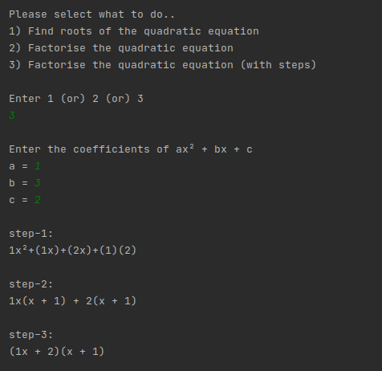

## **Quadratic Equation Solver**<br/>*By* *SKGEzhil*

It is a simple program which factorize and find the root of the given **Quadratic Equation**<br/>
It is written in **Python**

## Setup
1. Download the project from [Github](https://github.com/SKGEzhil/Quadratic-Equation-Solver) 
2. Copy all the files to a new folder
3. Run the file "main.py" <br/>```python3 main.py```<br/>
4. You can choose your choice of solving<br/><br/>
   
## Here is an example:

<br/>

It gives the result within a second<br/><br/>
If you find any issue please create an issue [here](https://github.com/SKGEzhil/Quadratic-Equation-Solver/issues) <br/>
To suggest any feature create an issue [here](https://github.com/SKGEzhil/Quadratic-Equation-Solver/issues) or contact ***skgezhil2005@gmail.com*** <br/>
To view the official repository on github [click here](https://github.com/SKGEzhil/Quadratic-Equation-Solver) <br/>
To view my official github page [click here](https://github.com/SKGEzhil) <br/>


### Support or Contact
For further details please contact **SKGEzhil** at ***skgezhil2005@gmail.com***

